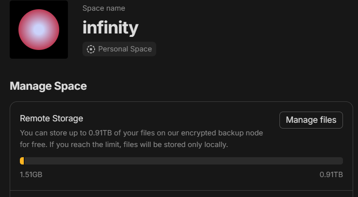

# Any-Sync File Node
> Implementation of file node from [`any-sync`](https://github.com/anyproto/any-sync) protocol.

# PURPOSE
This is forked from the official repository
<br>
This repository modifies the files index.go, limit.go, rcphandler.go, and filenode.go to overwrite 1GB limit
<br>
In my case I needed to inject in the file store\s3store\s3store.go the access key and the secret key, where it says `conf.Credentials.AccessKey`. Yo get those credentials in the minio web interface

# INSTRUCTIONS
Building is the same as before, but after building you should see much more available capacity


# DISCLAIRMER
* This is the equivalent version of v0.6.4 branch of https://github.com/anyproto/any-sync-filenode
* Works with anytype version 0.39

## Building the source
To ensure compatibility, please use Go version `1.22`.

To build and run the Any-Sync File Node on your own server, follow these technical steps:

1.  Clone the Any-Sync File Node repository to your local machine.
2.  Navigate to the root directory of the repository, where you will find a `Makefile`.
3.  Run the following commands to install the required dependencies and build the Any-Sync File Node.
    ```
    make deps
    make build
    ```
4.  If there are no errors, the Any-Sync File Node will be built and can be found in the `/bin` directory.

## Running
You will need an S3-compatible object storage and Redis to run Any-Sync File Node. Note that credentials are necessary to make requests to S3. For more information, refer to the [`aws-sdk-go` documentation](https://pkg.go.dev/github.com/aws/aws-sdk-go#readme-configuring-credentials).

Any-Sync File Node requires a configuration. You can generate configuration files for your nodes with [`any-sync-network`](https://github.com/anyproto/any-sync-tools) tool.

The following options are available for running the Any-Sync File Node:

 - `-c` — path to config file (default `etc/any-sync-filenode.yml`). 
 - `-v` — current version.
 - `-h` — help message.

## Contribution
Thank you for your desire to develop Anytype together!

❤️ This project and everyone involved in it is governed by the [Code of Conduct](https://github.com/anyproto/.github/blob/main/docs/CODE_OF_CONDUCT.md).

🧑‍💻 Check out our [contributing guide](https://github.com/anyproto/.github/blob/main/docs/CONTRIBUTING.md) to learn about asking questions, creating issues, or submitting pull requests.

🫢 For security findings, please email [security@anytype.io](mailto:security@anytype.io) and refer to our [security guide](https://github.com/anyproto/.github/blob/main/docs/SECURITY.md) for more information.

🤝 Follow us on [Github](https://github.com/anyproto) and join the [Contributors Community](https://github.com/orgs/anyproto/discussions).

---
Made by Any — a Swiss association 🇨🇭

Licensed under [MIT License](./LICENSE).
